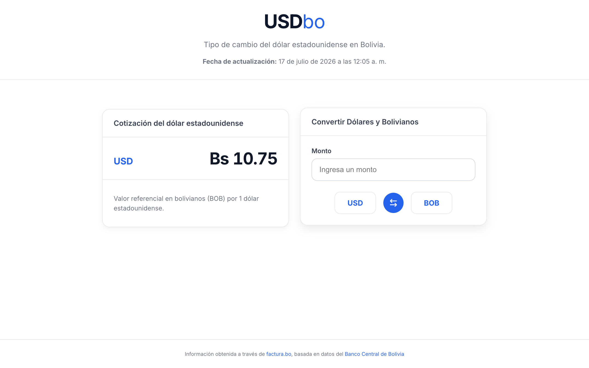
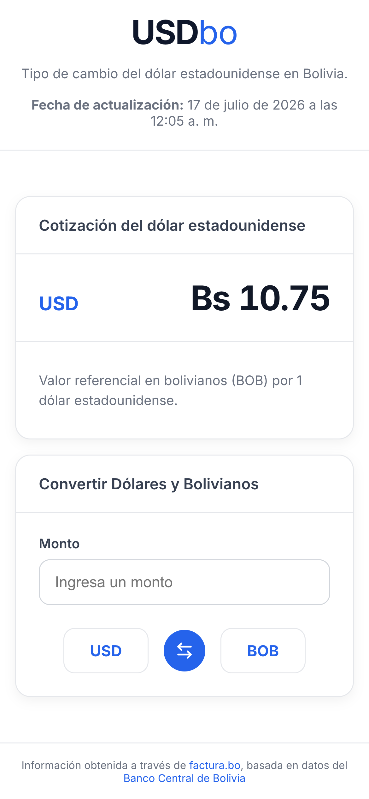

# USDbo

  <strong>US Dollar exchange rate in Bolivia</strong>

  Check the US dollar exchange rate and convert between USD and BOB through a simple, fast, and responsive interface.

---

## About the project

USDbo is a web application focused on providing a fast and simple way to check the US dollar exchange rate in Bolivia and perform conversions between US dollars (USD) and Bolivianos (BOB).

## Preview

### Desktop

  

### Mobile

  

## Features

- US dollar exchange rate lookup.
- Bidirectional conversion between USD and BOB.
- Date and time of the last update.
- Responsive design adapted for mobile and desktop devices.
- Loading and error state handling.
- Clear, modern, and easy-to-use interface.

## Application

Available at:

**https://usdbo.vercel.app/**

## Roadmap

Some improvements planned for future versions:

- Exchange rate history.
- Exchange rate evolution charts.
- Support for additional currencies.
- Interface and user experience improvements.

## Data source

USDbo uses the public **factura.bo** API to obtain the exchange rate, based on information from the **Banco Central de Bolivia (BCB)**.

- [factura.bo - Public API](https://api.factura.bo/ExchangeRate)
- [Banco Central de Bolivia - Official US dollar exchange rate](https://www.bcb.gob.bo/tco_reporte_ultima_cotizacion.php)

## Author

**Kevin Jayro Cardenas Ramirez**

Software Engineer

- [GitHub](https://github.com/kevinjayro)
- [LinkedIn](https://www.linkedin.com/in/kevinjayro-cardenaramirez/)

## Technologies used

  <table>
    <tr>
      <td align="center">
         
        React
      </td>
      <td align="center">
         
        TypeScript
      </td>
      <td align="center">
         
        Vite
      </td>
      <td align="center">
         
        CSS Modules
      </td>
      <td align="center">
         
        Vercel
      </td>
    </tr>
  </table>

## License

Distributed under the [MIT](LICENSE) license.

See the `LICENSE` file for more information.
